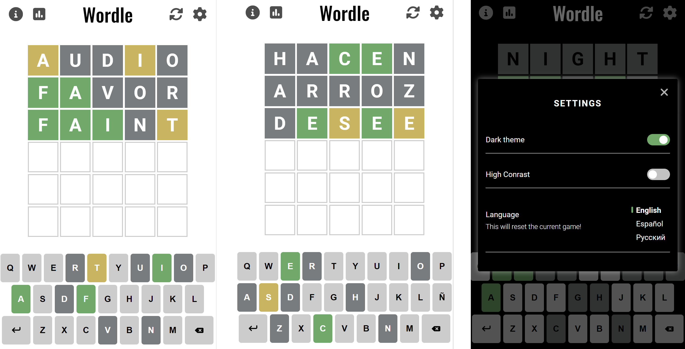

# WORDLE

This is my take on a famous [WORDLE puzzle](https://www.nytimes.com/games/wordle/index.html) with a few enhancements.

## Working sample

  The app is available at [wordle.pavelgrinkevich.com](https://wordle.pavelgrinkevich.com) and deployed using [Github Pages](https://pages.github.com/).

## Technologies

  The app is developed with vanilla [JavaScript ES6](https://www.w3schools.com/js/js_es6.asp) showing one can go a long way without a need for multiple libraries and frameworks. [Sass](https://sass-lang.com/) is used as a CSS preprocessor. The app also makes an extensive use of CSS variables for theming.
  The app is bundled with [Webpack 5.7](https://webpack.js.org/).

## Features

  The app is available in three languages, features a help and statistics popups, as well as theme settings. [LocalStorage](https://developer.mozilla.org/en-US/docs/Web/API/Window/localStorage) is used to store user statistics and settings. Custom dictionaries for each of the supported languages were filtered base on word frequency lists in each language.